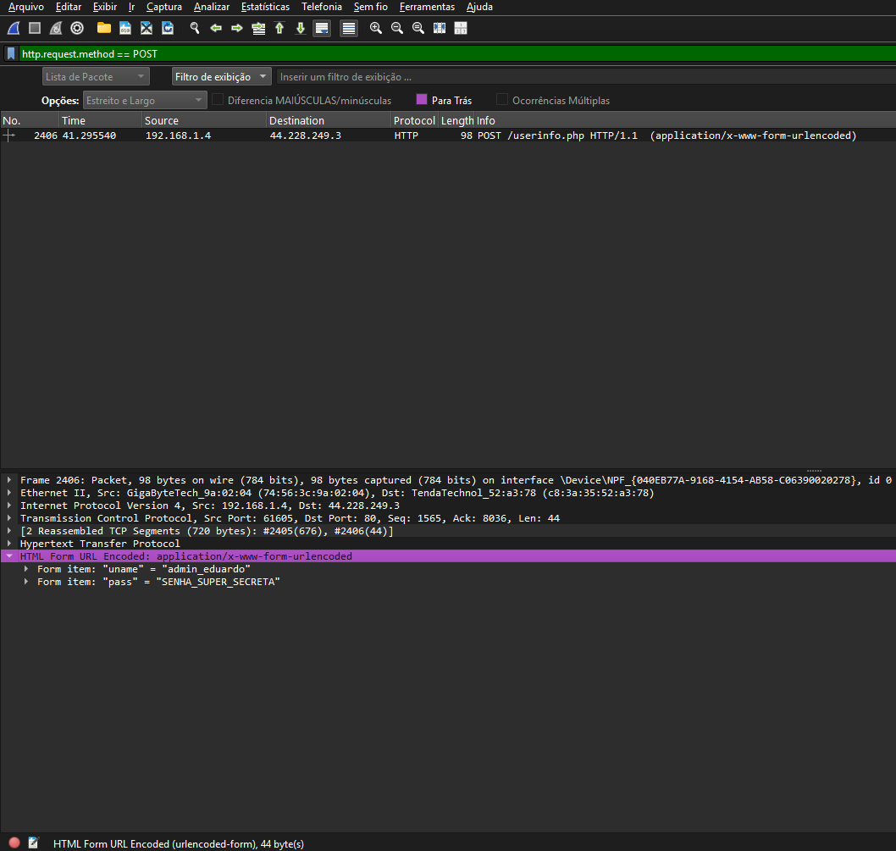

# Captura de Tráfego: O perigo do HTTP 🦈

Sempre ouvi dizer que o HTTP não é seguro, mas decidi realizar este laboratório para ver, na prática, como é fácil interceptar uma senha em uma rede sem criptografia.

Utilizei o **Wireshark** para monitorar minha própria rede enquanto fazia login em um site de testes. O objetivo não foi apenas capturar pacotes, mas entender onde os dados sensíveis ficam escondidos dentro da estrutura do protocolo TCP/IP.

## 🛠️ O que eu usei
* **Wireshark:** Para "escutar" a rede.
* **Site Alvo:** `testphp.vulnweb.com` (Um site feito propositalmente para testes de segurança).
* **Filtro:** `http.request.method == POST` (Para achar apenas o momento em que enviei o formulário de login).

## 📸 A Prova do Crime
Abaixo, o print mostra o momento exato em que capturei o pacote de login.
Ao expandir a linha `HTML Form URL Encoded`, consegui ler o usuário e a senha sem nenhuma dificuldade:

## 🧠 O que aprendi
1.  **Dados em Texto Claro:** Fiquei surpreso em ver que, sem o HTTPS, a senha trafega "pelada" na rede. Qualquer pessoa no mesmo Wi-Fi poderia ter lido isso.
2.  **Análise de Pacotes:** Aprendi a navegar nas camadas do pacote (Frame, Ethernet, IP, TCP) até chegar no payload onde estão os dados do usuário.
3.  **A importância do POST:** Entendi que, mesmo que a senha não apareça na URL lá em cima no navegador, ela está no "corpo" da mensagem (POST) e é fácil de achar com o filtro certo.

---
*Lab realizado em ambiente controlado para fins de estudo.*
